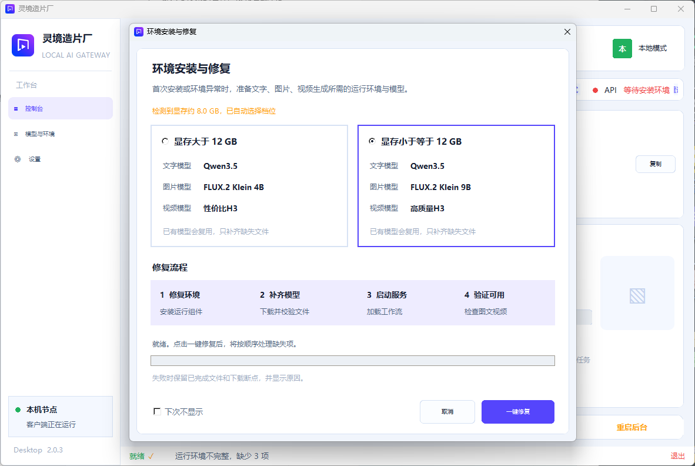

[简体中文](#灵境--lingjingapi) | [English](#english)

# 灵境 · LingJingAPI

**一键调用算力，简单好用。**

远程调用算力，生成文字、图片和视频。

将生成服务部署在有算力的机器上，其他电脑或手机通过 URL + API Key 调用。模型在服务端运行，调用端负责提交任务、查看和下载结果。

无需注册或登录平台；API Key 只用于保护你自己的生成接口。

两种典型用法：

- **租用远程算力**：服务部署在租用的算力服务器上，自己的电脑运行客户端页面，手机也能通过浏览器调用。
- **公司共享算力**：公司用一台机器部署好服务，同事通过局域网访问，各自在电脑或手机上生成文字、图片和视频。

**电脑 / 手机 ⇄ URL + API Key ⇄ 远程服务器 / 公司算力机器**

## 第一次使用：4 步开始

当前版本为 `2.0.7`。在本仓库的 Releases 页面下载程序安装包，安装到有 NVIDIA 显卡的 Windows 算力机器上；安装时可以选择目录。程序与运行环境分开发布，安装包**不含模型**。

1. **启动程序**：运行环境或 Qwen3.5 文字模型缺失时，会出现“环境安装与修复”窗口。图片、视频模型缺失不会单独触发弹窗，可在“模型与环境”中查看和管理。
2. **点击一键修复**：程序根据显存自动选择“大于 12 GB”或“小于等于 12 GB”档位。确认后点击“一键修复”，等待运行环境和文字、图片、视频模型下载、校验并启动；已有模型会复用。

FLUX.2 Klein 9B 的公开下载地址不改变其[非商业使用许可](https://help.bfl.ai/articles/9272590838-self-serve-dev-license-overview-pricing)；商用需取得模型方授权。



*截图摄于 2.0.3；2.0.4 已移除背景中的旧模式标识和平台登录入口，环境修复流程相同。*

3. **复制连接信息**：在控制台取得 URL 和 API Key。同一台机器用“本地 URL”，同一局域网的电脑或手机用“局域网 URL”，异地设备用已连接的“公网 URL”。请勿公开 API Key。
4. **开始生成**：在电脑或手机浏览器打开对应 URL，填入 API Key，选择可用工作流，输入提示词或上传参考图即可生成。

下载中断时，可到“模型与环境”再次点击“一键修复”；环境包自动下载失败时可按页面提示手动导入。卸载程序会保留模型和生成结果，并提示它们的保存位置。

## 支持哪些功能

- **图文视频生成**：文字生成、文生图、参考图编辑和视频生成，具体能力取决于工作流与模型。
- **多端调用**：支持电脑、手机、公网、本机及局域网访问。
- **工作流与 API**：导入 ComfyUI 工作流，管理环境和模型，为第三方软件提供调用接口。
- **统一任务队列**：电脑、手机和第三方请求按提交时间排队；可查看位置、取消等待或强制取消运行中的任务。

## 界面演示

电脑和手机通过客户端页面提交任务、查看作品。


算力端提供连接地址，并集中管理工作流、模型与运行环境。


*后两张为界面演示，连接信息和状态数值为演示数据。*

## 使用说明

当前发行包适用于 **Windows x64 算力端 + NVIDIA 显卡**，配套 CUDA 13 环境；电脑和手机可通过浏览器调用。服务端一键修复拉取失败时，可手动导入环境包。安装目录附带使用教学 PDF。

[Apache License 2.0](LICENSE) · [第三方许可声明](THIRD_PARTY_NOTICES.md)

### 接口调用

创作页右侧的“接口文档”会根据当前工作流展示参数和上传字段；第三方调用应以该页面及接口返回的 schema 为准。所有生成入口共用按提交时间排序的任务队列。

```bash
curl "https://your-server.example/v1/workflows?summary=true&available_only=true" \
  -H "Authorization: Bearer YOUR_API_KEY"
curl "https://your-server.example/v1/workflows/WORKFLOW_ID/schema" \
  -H "Authorization: Bearer YOUR_API_KEY"
curl -X POST "https://your-server.example/v1/workflows/run/WORKFLOW_ID" \
  -H "Authorization: Bearer YOUR_API_KEY" \
  -H "Content-Type: application/json" \
  -d '{"prompt":"一只在窗边晒太阳的猫"}'
```

提交后可用 `GET /v1/tasks/{task_id}` 查询任务，使用 `GET /v1/tasks/queue` 查看排队位置，使用 `POST /v1/tasks/{task_id}/cancel` 取消任务。生成文件可通过结果中的文件地址获取。公网访问应使用 HTTPS，并妥善保管生成 API Key；本机管理 Key 不应提供给调用方。

工作流位于 `workflows/<名称>/`，模型可放在 `models/` 或在客户端映射到其他位置。卸载程序不会递归删除模型、作品、运行环境或用户配置。

## English

**One-click access to compute power. Simple to use.**

Deploy LingJingAPI on a Windows x64 machine with an NVIDIA GPU, then generate text, images, and video from a computer or phone using its URL and API Key. This works with rented remote compute or one shared office GPU machine. No platform account is required.

Version `2.0.7`: download the installer from [Releases](https://github.com/Yaro-lu/LingJingAPI/releases). The program and runtime are distributed separately; the installer **does not include model weights**.

1. Launch the program. The repair window appears if the runtime or Qwen3.5 text model is missing. Missing image or video models alone do not trigger it; manage them in “Models & Environment”.
2. Use one-click repair. The program selects a profile based on whether VRAM is above 12 GB. It downloads and verifies the runtime and selected text, image, and video models; existing files are reused.
3. Copy the local, LAN, or public URL and the generation API Key from the control panel. Keep the Key private.
4. Open the URL in a browser, enter the Key, select an available workflow, and submit a prompt or reference image. API clients can inspect the workflow schema and task endpoints shown above.

The FLUX.2 Klein 9B public download link does not change its [non-commercial license](https://help.bfl.ai/articles/9272590838-self-serve-dev-license-overview-pricing); commercial use requires authorization from the model provider. The source code is offered under [Apache License 2.0](LICENSE), while third-party components retain their [own licenses](THIRD_PARTY_NOTICES.md).
