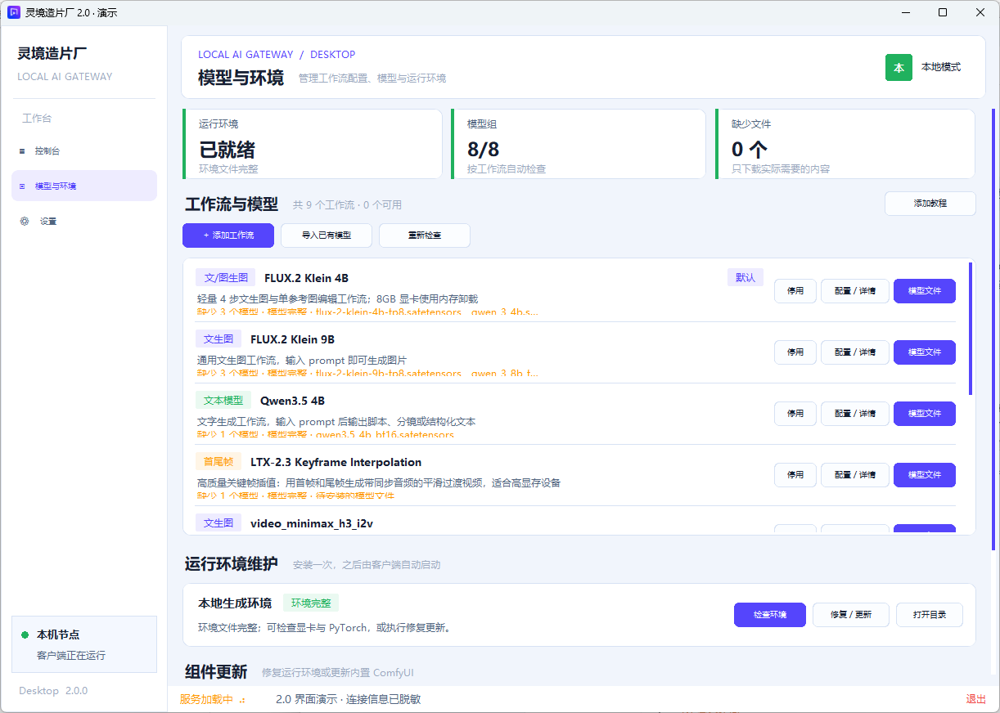
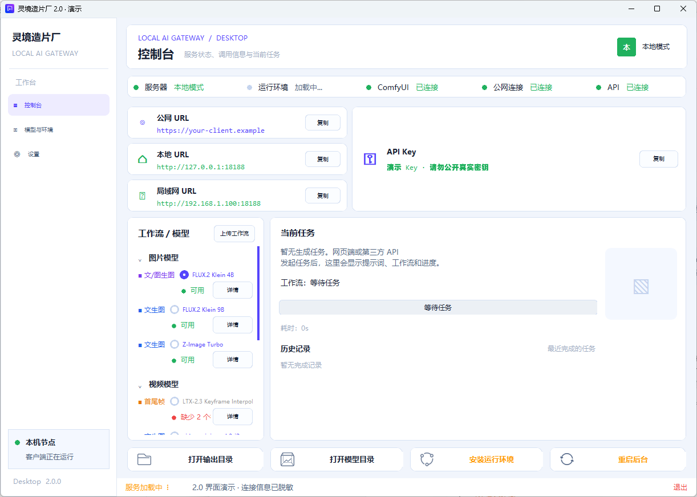
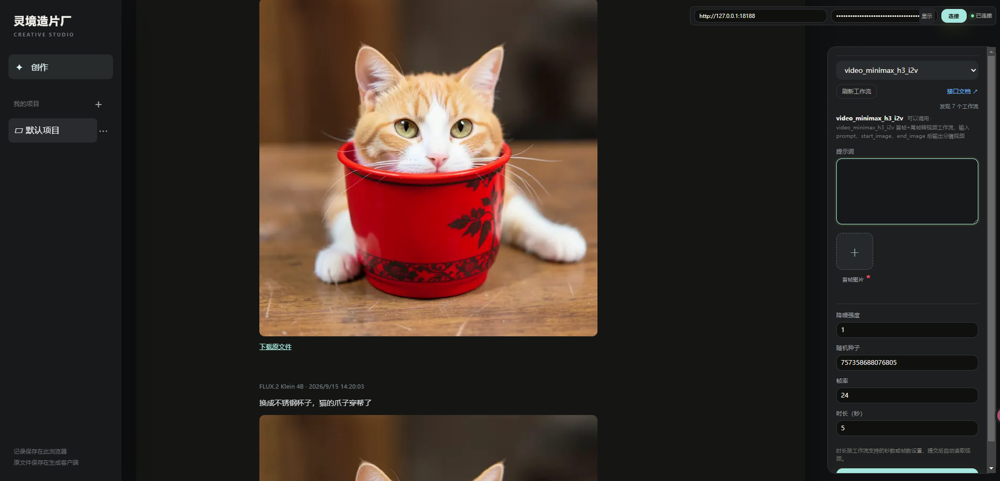

[简体中文](README.md) | [English](README_EN.md)

# 灵境造片厂 · LingJing AI Studio 2.0

**在 Windows 电脑上生成文字、图片和视频，把 ComfyUI 工作流变成网页和第三方软件都能调用的 API。**

支持文生图、参考图编辑、视频首尾帧等工作流；统一管理工作流、模型与运行环境。浏览器通过本机、局域网或公网 URL + API Key 连接，生成在你的电脑上完成。具体能力和显存需求取决于安装的工作流与模型。

## 下载 2.0

### [⬇ 下载 Windows 轻量客户端 2.0.0](https://github.com/Yaro-lu/LingJingAPI/releases/download/v2.0.0/LingJingAI-Setup-2.0.0-win-x64.exe)

### [⬇ 下载独立运行环境包 · NVIDIA / CUDA 13](https://github.com/Yaro-lu/LingJingAPI/releases/download/v2.0.0/runtime-nvidia-rtx20plus-cu130-v2.0.0.7z)

[全部版本与校验文件](https://github.com/Yaro-lu/LingJingAPI/releases) · [三步演示](#三步演示) · [接口调用](#接口调用) · [使用教学 PDF](docs/灵境造片厂使用教学.pdf)

当前版本：`2.0.0`。**程序与环境分别打包，两个包均不包含模型、生成作品、账号或个人配置。** 已有模型可以直接映射，无需再复制一份。

## 支持什么

| 功能 | 可以做什么 |
| --- | --- |
| 文字生成 | 系统提示词、用户提示词，按需要选择普通文本或 JSON 响应 |
| 图片生成与编辑 | 文生图、参考图编辑，工作流默认尺寸、比例与自定义宽高 |
| 视频生成 | 按工作流选择首帧、尾帧或参考图；设置帧率和时长，自动换算适配帧数 |
| 网页创作 | 左侧项目管理、右侧生成参数；按时间浏览作品、分批加载历史记录 |
| 轻量预览 | 图片先取预览，点击加载原图并放大；视频先显示首帧，播放时取视频 |
| 工作流与模型 | 导入工作流、配置公开参数、切换默认工作流；下载模型或映射已有模型目录 |
| 接口适配 | 每个工作流提供自己的参数和调用示例，支持异步任务与结果查询 |
| 三种访问方式 | 本机 URL、同网段局域网 URL、公网 HTTPS URL；直接打开地址进入创作页 |

工作流参数优先按规则识别。遇到不确定项时，可使用已部署的 Qwen3.5 4B 辅助识别；模型未就绪、服务离线或忙碌时跳过辅助推理，提示原因并保留手动配置入口。导入普通 ComfyUI 编辑器工作流还可通过后台原生转换得到 API 格式，需要本机安装 Edge 或 Chrome。

## 三步演示

### 1. 安装客户端，准备环境与模型

安装 `LingJingAI-Setup-2.0.0-win-x64.exe`，进入“模型与环境”安装运行环境。客户端支持下载、校验环境包，也可选择手动下载的 `.7z` 包安装。随后在“工作流与模型”中补齐需要的模型，或点击“模型文件”选择已有模型并建立映射。

一键修复自动拉取失败时，可从上方链接手动下载环境包，再回到客户端选择本地包安装。



*界面演示：工作流配置、模型文件和环境维护集中在同一页；状态数值为演示数据。*

### 2. 复制 URL，在浏览器打开

本机打开控制台显示的本地 URL（默认 `http://127.0.0.1:18188`）；手机或另一台电脑使用局域网 URL。外网使用公网 HTTPS URL。在网页右上角填写 API Key 并连接。网页会记住上次连接信息，刷新时自动尝试连接一次。



*界面演示：公网地址与 Key 为占位信息，不可用于连接。*

### 3. 选择工作流，输入提示词，开始生成

例如先使用 FLUX.2 Klein 4B 输入“一只猫坐在杯子里”，再把作品加入参考图，输入“把杯子换成红色”。点击生成后自动定位到任务进度；完成后查看预览、点击放大或下载原文件。视频工作流可进一步使用图片作为首帧。



*用户提供的实际创作页面：中间展示历史图片，右侧可以切换到视频工作流。示例提示词用于说明操作，不保证每次生成相同画面。*

## 安装与使用说明

- Windows 10 22H2 / Windows 11，64 位；当前运行环境面向 NVIDIA RTX 20 系列及以上显卡。
- CUDA 13 环境要求 NVIDIA R580 或更高驱动。8GB 显存可尝试轻量工作流，大型图片和视频模型以详情页要求为准。
- 为环境、模型及输出预留磁盘空间，优先使用固态硬盘。
- 模型按工作流单独准备；网页只显示当前可用的工作流，客户端管理页仍能查看缺失项。
- 已有 1.x 用户升级前保留自己的配置与目录。程序升级与环境更新分开，缺少新版依赖时再安装 2.0 环境包。

### 局域网与公网

同一 Wi-Fi 的手机使用电脑的局域网 URL。客户端需运行并允许该端口通过 Windows 防火墙；访客 Wi-Fi 或路由器设备隔离可能阻止访问。浏览器直接打开 URL 能避免在手机文件预览器内打开 HTML 的限制。

客户端默认尝试建立 Cloudflare Tunnel。公网页面可以打开，读取状态、生成和获取作品仍需有效 API Key；不用公网时可停止公网连接或后台服务。公网使用 HTTPS，本机与受支持的私有局域网地址可使用 HTTP。

### 作品与项目

默认文件保存在 `outputs/`，可在客户端修改模型、工作流和生成结果目录并扫描适配。网页的项目分类与历史记录保存在浏览器，同一浏览器中更换 URL 或 Key 不会主动清空历史；读取原文件仍需要连接保存这些文件的客户端。

项目菜单支持重命名和删除。**删除项目仅移除分类，作品转入未归档；作品右键菜单里的“删除文件”会删除对应本地文件。** 两个操作含义不同。

网页连接信息会保存在当前浏览器，适合自己的设备。当前按单用户设计，不提供不同 Key 之间的作品隔离，也不提供跨浏览器项目同步。

## 接口调用

创作页右侧“接口文档”会展示**当前工作流**的接口、参数、上传字段和调用步骤，第三方应以该文档及 schema 为准。

```bash
# 1. 获取可用工作流
curl "http://127.0.0.1:18188/v1/workflows?summary=true&available_only=true" \
  -H "Authorization: Bearer YOUR_API_KEY"

# 2. 获取所选工作流参数（替换 WORKFLOW_ID）
curl "http://127.0.0.1:18188/v1/workflows/WORKFLOW_ID/schema" \
  -H "Authorization: Bearer YOUR_API_KEY"

# 3. 提交任务；具体参数以 schema 为准
curl -X POST "http://127.0.0.1:18188/v1/workflows/run/WORKFLOW_ID" \
  -H "Authorization: Bearer YOUR_API_KEY" \
  -H "Content-Type: application/json" \
  -d '{"prompt":"一只在窗边晒太阳的猫"}'
```

| 方法 | 路径 | 用途 |
| --- | --- | --- |
| `GET` | `/` | 打开创作网页 |
| `GET` | `/healthz` | 最小存活状态 |
| `GET` | `/v1/status` | 运行状态，需要 Key |
| `GET` | `/v1/workflows` | 工作流列表，可筛选可用项 |
| `GET` | `/v1/workflows/{workflow_id}/schema` | 当前工作流公开参数 |
| `POST` | `/v1/workflows/run/{workflow_id}` | 提交工作流任务 |
| `GET` | `/v1/tasks/{task_id}` | 查询任务进度与结果 |
| `GET` | `/v1/files/{task_id}/{filename}` | 获取生成原文件 |
| `POST` | `/v1/chat/completions` | OpenAI 风格文字接口 |
| `POST` | `/api/v3/images/generations` | 即梦 / 火山风格图片接口 |

图片与视频任务采用异步方式，提交后使用返回的任务 ID 查询状态，再按结果中的文件地址获取作品。参数及媒体格式因工作流而异。

## 源码与维护

仓库仅提供源码、文档、示例工作流和发行脚本。完整环境准备好后可运行 `start.bat`；环境诊断使用 `check-env.bat`。开发时使用 `runtime\python\python.exe`。

工作流放在 `workflows/<名称>/`，包含 `manifest.json` 和 `workflow.json`。模型既可放在 `models/`，也可通过客户端映射到其他位置。导入外部工作流后检查依赖、公开参数和模型路径。

ComfyUI 更新保留官方主源，国内备用为 GitCode / Gitee 独立镜像。备用流程从镜像查询版本和获取代码，需要本机 Git；镜像可能滞后。更新保留提交与本地修改校验，不能兼容的依赖更新会停止并提示，不强制重置用户内容。

发行脚本：`scripts/build_release.ps1` 生成轻量安装包，`scripts/build_runtime_release.ps1` 单独生成经过目录白名单与校验的环境包。

## 安全、隐私与许可

- 生成 API Key 与本机管理 Key 分离，客户端使用 Windows DPAPI 保护本机密钥。不要将管理 Key 交给第三方。
- 本地生成不会自动上传作品。主动登录平台后，客户端会向指定平台同步调用地址、生成 API Key、设备及任务状态；只连接可信平台。退出平台不自动轮换已共享的 Key，需要时在设置中重新生成。
- 浏览器保存的连接信息和高级配置中的第三方模型 Key 不应公开。发行包排除密钥、会话、日志、模型权重和生成资产。
- 卸载可能清理安装目录中的程序、后装环境、模型和工作流；默认 `outputs` 中的生成资产保留。重要文件请独立备份。
- 作者有权授权的源码与文档采用 [Apache License 2.0](LICENSE)。第三方组件、外部工作流、模型及素材分别遵守其原始许可，见 [第三方声明](THIRD_PARTY_NOTICES.md) 和 [开源许可说明](开源许可说明.txt)。
