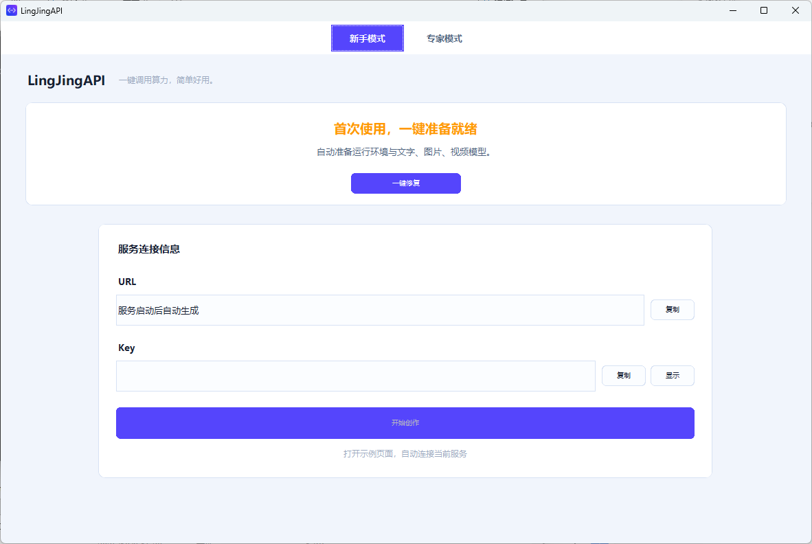

[简体中文](#lingjingapi) | [English](#english)


# LingJingAPI

**一键调用算力，简单好用。**

远程调用算力，生成文字、图片和视频。

将生成服务部署在有算力的机器上，其他电脑或手机通过 URL + API Key 调用。模型在服务端运行，调用端负责提交任务、查看和下载结果。

无需注册或登录平台；API Key 只用于保护你自己的生成接口。

## 项目特点

- **租用远程算力**：服务部署在租用的算力服务器上，自己的电脑运行客户端页面，手机也能通过浏览器调用。
- **公司共享算力**：公司用一台机器部署好服务，同事通过局域网访问，各自在电脑或手机上生成文字、图片和视频。
- **新手友好**：一键完成部署，不需要复杂的配置。
- **AI自动识别工作流**：部署好文字工作流之后，会自动调用该工作流去识别参数，一键帮你识别工作流，调整相关参数。

**电脑 / 手机 ⇄ URL + API Key ⇄ 远程服务器 / 公司算力机器**

## 第一次使用：4 步开始

当前版本为 `2.1.1`。在本仓库的 Releases 页面下载程序安装包，安装到有 NVIDIA 显卡的 Windows 算力机器上；安装时可以选择目录。程序与运行环境分开发布，安装包**不含模型**。

程序与桌面入口统一名为 **LingJingAPI**。新安装默认目录为 `%LOCALAPPDATA%\Programs\LingJingAPI`；升级保留原安装位置、模型和生成结果。安装目录附带 `LingJingAPI示例页.html` 与 `LingJingAPI使用教学.pdf`。

1. **启动程序**：默认进入新手模式，环境或 Qwen3.5 缺失时提示“一键修复”，无需填写配置。已有可用环境会直接启动服务。顶部居中的标签可以切换到专家模式，原控制台、模型管理和设置界面完整保留，并记住上次选择。
2. **点击一键修复**：新手模式根据显存自动选择默认图文视频模型，准备环境、下载校验、启动服务并验证工作流；已有文件会复用，环境替换重启后继续修复。专家模式仍可手动选择显存档位。启动检查只读取环境和 Qwen3.5 状态，大文件 SHA256 校验仅在点击修复后进行。

FLUX.2 Klein 9B 的公开下载地址不改变其[非商业使用许可](https://help.bfl.ai/articles/9272590838-self-serve-dev-license-overview-pricing)；商用需取得模型方授权。

修复前会显示环境与模型的完整下载量及本次剩余下载量；全新安装约需下载 **52.06 GB 或 67.30 GB**，取决于所选模型档位。已有文件与下载断点会复用，进度按实际字节计算，安装后的磁盘占用另计。



*新手模式集中显示服务状态、URL、Key 与“一键修复”；专家模式保留完整管理界面。截图中的首次引导提示以当前实际环境检测结果为准。*

3. **等待启动成功**：新手模式显示服务状态、URL 和生成 Key；URL 优先显示可用公网地址，其次局域网、本机地址。专家模式可以分别查看三种地址。请勿公开 API Key。
4. **开始生成**：新手模式点击“开始创作”，打开本机示例页面并自动连接。其他电脑或手机打开对应 URL，填入 Key，选择工作流，输入提示词或上传参考图即可生成。

下载中断时，可到“模型与环境”再次点击“一键修复”；环境包自动下载失败时可按页面提示手动导入。卸载程序会保留模型和生成结果，并提示它们的保存位置。

## 支持哪些功能

- **图文视频生成**：文字生成、文生图、参考图编辑和视频生成，具体能力取决于工作流与模型。
- **多端调用**：支持电脑、手机、公网、本机及局域网访问。
- **工作流与 API**：导入 ComfyUI 工作流，管理环境和模型，为第三方软件提供调用接口。
- **统一任务队列**：电脑、手机和第三方请求按提交时间排队；可查看位置、取消等待或强制取消运行中的任务。
- **可选第三方模型**：在“模型与环境”中配置 DeepSeek 文字、火山方舟 Seedream 图片与 Seedance 视频，或安装并绑定即梦 CLI。第三方调用使用你自己的服务商账号和额度。

## 界面演示

电脑和手机通过客户端页面提交任务、查看作品。


算力端提供连接地址，并集中管理工作流、模型与运行环境。


*截图保留旧版界面样式，当前程序统一使用 LingJingAPI 名称与新图标。后两张为界面演示，连接信息和状态数值为演示数据。*

## 使用说明

当前发行包适用于 **Windows x64 算力端 + NVIDIA 显卡**，配套 CUDA 13 环境；电脑和手机可通过浏览器调用。服务端一键修复拉取失败时，可手动导入环境包。安装目录附带使用教学 PDF。

[Apache License 2.0](LICENSE) · [第三方许可声明](THIRD_PARTY_NOTICES.md)

### 接口调用

创作页右侧的“接口文档”会根据当前工作流展示参数和上传字段；第三方调用应以该页面及接口返回的 schema 为准。所有生成入口共用按提交时间排序的任务队列。

```bash
curl "https://your-server.example/v1/workflows?summary=true&available_only=true" \
  -H "Authorization: Bearer YOUR_API_KEY"
curl "https://your-server.example/v1/workflows/WORKFLOW_ID/schema" \
  -H "Authorization: Bearer YOUR_API_KEY"
curl -X POST "https://your-server.example/v1/workflows/run/WORKFLOW_ID" \
  -H "Authorization: Bearer YOUR_API_KEY" \
  -H "Content-Type: application/json" \
  -d '{"prompt":"一只在窗边晒太阳的猫"}'
```

提交后可用 `GET /v1/tasks/{task_id}` 查询任务，使用 `GET /v1/tasks/queue` 查看排队位置，使用 `POST /v1/tasks/{task_id}/cancel` 取消任务。生成文件可通过结果中的文件地址获取。公网访问应使用 HTTPS，并妥善保管生成 API Key；本机管理 Key 不应提供给调用方。

工作流位于 `workflows/<名称>/`，模型可放在 `models/` 或在客户端映射到其他位置。卸载程序不会递归删除模型、作品、运行环境或用户配置。

### 第三方模型

在算力端打开“模型与环境”→“第三方模型”→“配置”。DeepSeek 填自己的 API Key；火山 Seedream、Seedance 分别填写火山方舟 API Key 与模型 ID / 推理接入点 ID。即梦 CLI 先从[即梦官方 CLI 页面](https://jimeng.jianying.com/cli)安装，在配置中选择 `dreamina.exe`，保存后点击“绑定账号”按页面提示完成授权。每个渠道单独启用，未配置的渠道不会出现在浏览器的可用工作流列表中。

配置保存在本机 `runtime/providers.local.txt`，API Key 经当前 Windows 用户的 DPAPI 加密；即梦 CLI 使用 `runtime/dreamina-cli/` 作为独立资料目录，系统凭据库仍由官方 CLI 管理。客户端的生成 API Key 只能调用已启用的渠道，不能读取第三方 Key 或修改服务地址。云端图片、视频结果下载到本机输出目录后通过原有任务接口获取。

浏览器创作页选择相应的第三方模型即可提交。第三方软件也可以调用 `POST /v1/workflows/run/cloud_deepseek`、`cloud_seedream`、`cloud_seedance`、`cloud_dreamina_image` 或 `cloud_dreamina_video`；兼容接口还支持明确指定云模型的 `POST /v1/chat/completions`、`POST /api/v3/images/generations` 和 `POST /v1/videos/generations`。响应中的 `task_id` 与本地工作流使用同一队列和查询接口。也可通过 `GET /v1/providers` 查看不含密钥的配置状态。云服务实际生成可能产生服务商费用；本项目的自动化测试不发起付费调用。

## English

**One-click access to compute power. Simple to use.**

Deploy LingJingAPI on a Windows x64 machine with an NVIDIA GPU, then generate text, images, and video from a computer or phone using its URL and API Key. This works with rented remote compute or one shared office GPU machine. No platform account is required.

Version `2.1.1`: download the installer from [Releases](https://github.com/Yaro-lu/LingJingAPI/releases). The program and runtime are distributed separately; the installer **does not include model weights**.

1. Beginner mode offers one-click setup when the runtime or Qwen3.5 is missing, and starts an already working installation directly. The centered switch at the top opens Expert mode with the original dashboard, model management and settings; your mode is remembered.
2. One-click repair automatically chooses the existing VRAM profile and prepares the runtime and default text, image and video workflows. Files are reused and repair resumes after runtime replacement. Startup checks remain lightweight; model hashes are checked only after clicking repair. Expert mode retains manual profile selection.
   The dialog estimates the total and remaining download volume. A fresh setup downloads approximately 52.06 GB or 67.30 GB, depending on the model profile; reused files and resumable data are credited. Download progress is weighted by bytes; installed disk usage differs.
3. Wait for the service to report a successful start, then copy its URL and generation Key if needed. The displayed URL prefers a working public address, then LAN, then local access. Keep the Key private.
4. Click “Start creating” to open the existing example page with the local connection filled in automatically. Other devices can open the shared URL and enter the Key. API clients can inspect the workflow schema and task endpoints shown above.

The FLUX.2 Klein 9B public download link does not change its [non-commercial license](https://help.bfl.ai/articles/9272590838-self-serve-dev-license-overview-pricing); commercial use requires authorization from the model provider. The source code is offered under [Apache License 2.0](LICENSE), while third-party components retain their [own licenses](THIRD_PARTY_NOTICES.md).

Optional cloud channels are configured in **Models & Environment**: DeepSeek for text, Volcengine Ark Seedream for images, Seedance for video, and the separately installed [official Dreamina CLI](https://jimeng.jianying.com/cli) for images/video. Your own provider credentials are protected locally with Windows DPAPI. Enabled channels appear as selectable workflows and share the existing task queue; provider credentials are never returned by the generation API.
